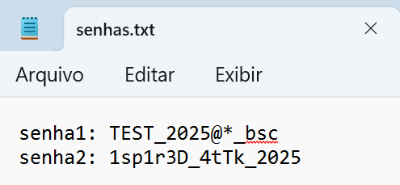
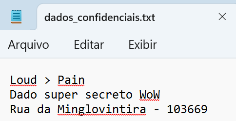
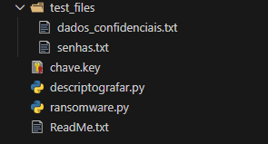
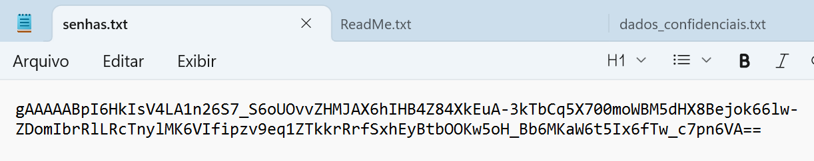
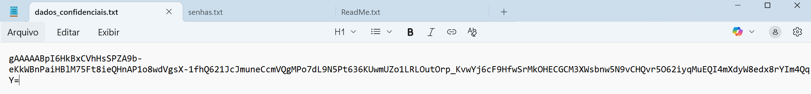

# Desafio_Final_Ransomware_Keylogger_DIO
Documentação do Desafio de simulação de Ransomware e Keylogger simples.

Fala, pessoal! 

Esse repositório mostra meus estudos e tentativas de resolução e aprimoramento do Desafio Final da DIO. O objetio era criar e entender como um Ransomware e um Keylogger funcionam em sua raiz.

Foi uma experiência incrível ver na prática conceitos que a gente só ouve falar em notícias ou em filmes. Implementei tudo em **Python** de forma controlada e seguindo os passos dados pelos experts.

---

## O que foi desenvolvido:

### 1. Ransomware 
Criei um script que criptografa arquivos usando a biblioteca `cryptography` (padrão Fernet). Faz uma simulação de ataque real:
- Varre uma pasta alvo.
- Criptografa os arquivos, ou seja, a vítima não consegue mais ler.
- Gera uma chave única de descriptografia.
- Deixa uma mensagem de "resgate".

*O arquivo original e o arquivo criptografado:*

|  |  |

Ao rodar o script `ransomware.py`, ele gera a chave de criptografia (`chave.key`) e o aviso de resgate (`ReadMe.txt`) automaticamente na pasta:

A mensagem de resgate deixada para o usuário:

Dados após o ataque:

 | 

> *Também criei o **Decrypter**, que faz com que tudo volte ao normal após o "pagamento" do Ransomware*
---

### 2. Keylogger (tentativa de fazer com que fosse enviado via e-mail):
Fiz um monitor de teclado usando a biblioteca `pynput`.
- Ele roda em segundo plano.
- Captura tudo o que é digitado.
- **Furtividade:** Foi adicionada a extensão `.pyw`, que faz com que o Windows rode em segundo plano, tornando assim o script mais furtivo.
- **Export:** Ao finalizar a captura (pressionando ESC), ele envia o log automaticamente para o e-mail.

---

## Como se Defender?

Durante o desenvolvimento, percebi que o maior inimigo não é o código complexo, mas a falta de atenção. Aqui estão minhas reflexões sobre defesa:

1.  **Backup é essencial:** Ao ter um backup dos dados, como exemplo do `test_files`, o Ransomware seria inútil. Não precisaria pagar resgate.
obs: Não guarde senhas ou dados confidenciais em pastas `.txt`, utilize a nuvem protegida com autenticação multi fatores.
3.  **Cuidado com o que clica:** O Keylogger precisa ser executado. Se a vítima não clicar no arquivo, nada acontece. Phishing é a porta de entrada.
4.  **Antivírus e EDR:** De acordo com o que estudei e pesquisei, um bom antivírus (NÃO CRACKEADO) detectaria o comportamento estranho do `pynput` monitorando as teclas globais ou a conexão SMTP tentando enviar o e-mail.
5.  **Atualizações:** Manter o sistema atualizado fecha brechas que malwares mais complexos usam para escalar privilégios.

---

**Não usem esse conhecimento para o mal!**.

---
